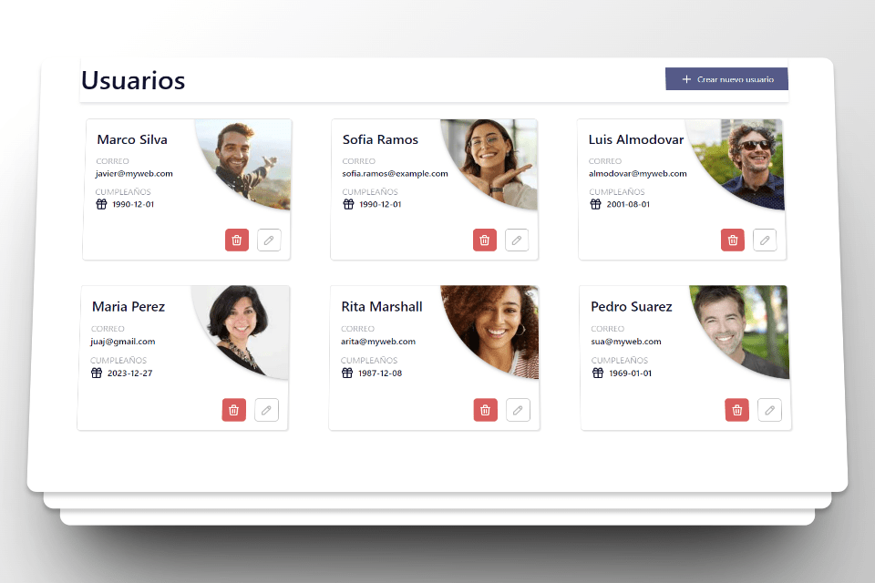

# User Management Web App

This web application allows users to create, delete, edit, and view users by utilizing an internal API for user management.

## Key Features

- **User Creation:** Enables users to create new profiles using an interactive form with integrated validations to ensure accurate and complete data.
- **Editing and Deletion:** Provides an easy and intuitive interface to edit and remove existing users.
- **Animations and User Experience:** Incorporates Framer Motion to add transitions and animations, enhancing the user experience.
- **Notifications:** Implements React Toastify to display notifications to users regarding successful operations or errors.
- **Date Selection:** Utilizes React Tailwind Date Picker to facilitate easy and user-friendly date selection.
- **Icons and Interface:** Utilizes Tabler Icons for an extensive collection of icons and Tailwind CSS with Daisy UI for an attractive and responsive interface.

## Tools Used

- [Vite](https://vitejs.dev/)
- [React](https://reactjs.org/)
- [Framer Motion](https://www.framer.com/motion/)
- [React Hook Form](https://react-hook-form.com/)
- [React Toastify](https://fkhadra.github.io/react-toastify/introduction)
- [Axios](https://axios-http.com/)
- [React Tailwind Date Picker](https://www.npmjs.com/package/react-tailwind-datepicker)
- [Tabler Icons](https://tablericons.com/)
- [Tailwind CSS](https://tailwindcss.com/)
- [Daisy UI](https://daisyui.com/)

## Requirements and Setup

- Ensure you have Node.js and npm installed in your development environment.
- Clone this repository using `git clone https://github.com/your_username/your_repository.git`.
- Install the dependencies using `npm install`.
- Configure necessary environment variables for the internal API (if applicable) in a `.env` file.

## Running the Application

- Run `npm start` to start the application in development mode.
- Open your browser and navigate to `http://localhost:3000` to see the application in action.

## Contributions

Contributions are welcome! If you have ideas to improve the application, please open an issue or send a pull request.

## Authors

This project was created by:
- [Jesús Aguilar](https://github.com/JesusAguilarAliaga)
- [Dergi Samayoa](https://github.com/DergiSamayoa)
- 

## Acknowledgments

We extend our gratitude to the software development communities for the tools and libraries used in this project.

# - Español -

Esta aplicación web permite a los usuarios crear, eliminar, editar y visualizar usuarios utilizando una API interna para la gestión de usuarios.

## Características principales

- **Creación de usuarios:** Permite a los usuarios crear nuevos perfiles con un formulario interactivo y validaciones integradas para asegurar datos precisos y completos.
- **Edición y eliminación:** Ofrece la capacidad de editar y eliminar usuarios existentes de manera fácil e intuitiva.
- **Animaciones y experiencia de usuario:** Utiliza Framer Motion para añadir transiciones y animaciones a la interfaz, mejorando así la experiencia del usuario.
- **Notificaciones:** Implementa React Toastify para mostrar notificaciones al usuario sobre operaciones exitosas o errores.
- **Selección de fechas:** Emplea React Tailwind Date Picker para permitir la selección de fechas de manera sencilla y amigable.
- **Íconos e interfaz:** Utiliza Tabler Icons para una colección extensa de íconos y Tailwind CSS con Daisy UI para una interfaz atractiva y responsiva.

## Requisitos y Configuración

- Asegúrate de tener Node.js y npm instalados en tu entorno de desarrollo.
- Clona este repositorio utilizando `git clone https://github.com/tu_usuario/tu_repositorio.git`.
- Instala las dependencias usando `npm install`.
- Configura las variables de entorno necesarias para la API interna (si aplica) en un archivo `.env`.

## Ejecutar la aplicación

- Ejecuta `npm start` para iniciar la aplicación en modo desarrollo.
- Abre tu navegador y navega a `http://localhost:3000` para ver la aplicación en funcionamiento.

## Contribuciones

¡Las contribuciones son bienvenidas! Si tienes ideas para mejorar la aplicación, por favor abre un "issue" o envía una solicitud de extracción ("pull request").

## Autores

Este proyecto fue creado por:
- [Jesús Aguilar](https://github.com/JesusAguilarAliaga)
- [Dergi Samayoa](https://github.com/DergiSamayoa)
-

## Agradecimientos

Agradecemos a las comunidades de desarrollo de software por las herramientas y librerías utilizadas en este proyecto.
